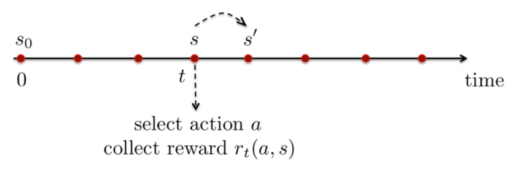

## Components of Markov Decision Processes (MDP)

- State of the environment / system
- Action determined by the agent: affects the state
- Reward : evaluates the benefit of state and action

At each time step t:

- Agent
    - observes state $s_t$
    - executes action $a_t$
    - receives reward $r_t$
- Environment
    - receives action $a_t$
    - emits reward $r_t$
    - updates state to $s_{t+1}$

## Rewards
- Reward $r_t = r(s_t, a_t) \in \mathbb{R}$ is a scalar feedback signal
- Indicates how well the agent is doing at step $t$
- The agent's job is to maximize the expected cumulative reward
"All goals can be described by the maximization of expected cumulative rewards"

### Examples of Rewards
1. Control of a drone
	- + reward for following desired trajectory
	- - reward for crashing
2. Control of a humanoid robot to walk
	- + reward for forward walking
	- - reward for falling over
3. Portfolio management
	- + reward for earning money
	- - reward for losing money
4. (Computer) Games
	- + reward for increasing score
	- - reward for decreasing score

## Sequential Decision Making

- Goal : select actions over time to maximize the expected cumulative reward
- Actions may have long term effects. Q) Why?
- It may be better to sacrifice immediate reward to gain more long-term reward. Q) How?

- State: $s_t \in S$
- Action: $a_t \in A$
- Policy (mapping from state to action): $\pi$ 
	- Deterministic                           $\pi(s_t) = a_t$
		- 행동을 딱 하나 결정. 같은 state가 들어오면 항상 같은 action을 선택
	- Stochastic (randomized)        $\pi(a|s) = Prob(a_t = a|s_t = s)$
		- state가 $s$일 때 action $a$를 선택할 확률
	$\rightarrow$ Policy is what we want to optimize!

## Markov Decision Processess (MSPs)

![[MDPs.png|487]]

$p$ : 현재 state가 $s$ 이고 action $a$ 를 했을 때, 다음 state가 $s'$ 이 될 확률
$\gamma$ : 미래 reward를 얼마나 중요하게 생각할 것인가

## The MDP Problem

To find an optimal policy that maximizes the expected cumulative reward:

![[optimal_policy.png|276]]

- Difficult to solve Q) Why?
- Solution we'll study: Dynamic Programming (DP)

### State
- At each stage (or time), the system occupies a state.
	- 매 순간 t마다 시스템은 어떤 하나의 상태에 있다.
- Notation: $s_t$ (state at stage $t$ (or time $t$))
- It quantifies the status of the system
- Example: position, velocity, temperature, chemical concentration, wealth, population
- $S$ : set of states (state space)
	- e.g., $S = \{1, ... , n\}$ (discrete), $S = \mathbb{R}^n$ (continuous)

### Action
- At each stage, the decision marker observes the system state and choose an action.
- Notation: $a_t$ (action at stage $t$)
- It quantifies the adjustable input to the system.
- Example: acceleration, steering, ON/OFF, buy/sell
- $A$: set of actions (action space)
	- e.g., $A = {1, ..., m}$ (discrete), $A = \mathbb{R}^m$ (continuous) 
- Actions may be chosen either randomly or deterministically
	- Deterministic policy인지 Stochastic policy인지에 따라서

### Rewards
- As a result of choosing action $a_t$ in state $s_t$ at stage $t$, the decision marker receives a reward, $r(s_t, a_t)$.
- Notation: $r : S$ x $A \rightarrow \mathbb{R}$ (reward function)
- It quantifies how well the immediate action and state are chosen.
- It does not measure the benefits from future actions or states.
- Example: income, score, negative cost

### Transition Probabilities
- If the decision maker chooses action $a_t$ in state $s_t$ at stage $t$, the system state at the next stage is determined by the probability distribution $p( · | s_t, a_t)$, called the transition probability.
	- $p( · | s_t, a_t)$ 는 가능한 모든 next state를 말함.
	- 현재 시간이 t이고, $s_t$라는 state에 있다고 했을 때, Agent가 policy에 따라서 $a_t$ 라는 action을 선택함. 다만 이때 같은 state에서 같은 action을 해도 다음 state가 항상 똑같다는 보장이 없을 수 있음.
	- For example, 로봇이 현재 서 있는 state에서 a = 앞으로 한 발 내딛기 를 했다고 하자. 이때 결과가 
		- P(정상적으로 전진) = 0.8
		- P(휘청거림) = 0.15
		- P(넘어짐) = 0.05 일 수 있다. 
	- 이렇게 다음 state가 어떻게 될지에 대한 확률 분포를 transition probability라고 한다.
- It describes how the system evolves over time (modeling stochastic dynamics).
- Notation: $p(s'|s, a) := Prob(s_{t+1} = s'|s_t = s, a_t = a)$ (transition probability function)
	- 현재 state가 $s$이고 action $a$를 선택했다는 조건에서, 다음 state $s_{t+1}$가 $s'$이 될 확률 
- We usually assume that
- $\sum_{s'\in S}p(s'|s,a)=1\qquad\forall(s,a)\in S\times A$

### Decision Rules
- A decision rule prescribes a procedure for action selection in each state at a specified stage.
- Notation: $\pi_t : S \rightarrow A$ ((deterministic Markov) decision rule)
- Markov vs history dependent
	- Markov는 현재 state만 보고 action을 결정함
	- history는 현재 state뿐 아니라 과거 기록도 고려함
- deterministic vs stochastic (randomized)
	- deterministic은 state $s$가 주어지면 action 하나가 확정
	- stochastic은 state $s$에서 각 action을 선택할 확률분포가 나옴
- A fundamental question in MDP : 
	- Under what conditions is it optimal to use a deterministic Markov decision rule at each stage

### Policy
- A policy or strategy specifies the decision rule to be used at all stages.
- Notation: $\pi := (\pi_1, \pi_2, ...)$
- A policy is called stationary if $\pi_t$'s are identical for all $t$.
	- 모든 시간에서 똑같은 decision rule을 사용하면 stationary policy
- Policy is what we'll optimize.
- Often use the term "policy" instead of "decision rule".

