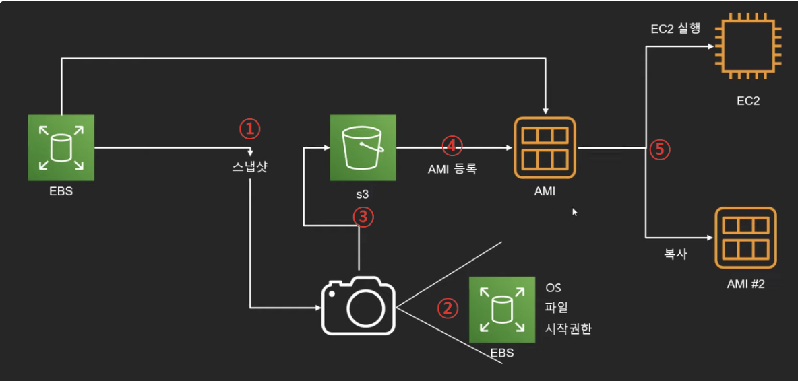

-> 컴퓨터를 사용하면 프로그램도 설치하고, 파일도 저장하고 설정도 변경하게 되는데, 이 OS 상태를 그대로 저장하는 기능을 이미지 (AMI)라고 한다. (윈도우 백업 설정 같은)
## AMI (Amazon Machine Images)
EC2 인스턴스를 실행하기 위해 필요한 정보를 모은 단위 (이미지)
- OS, 아키텍처 타입, 저장공간 용량 등
![[스크린샷 2024-07-08 오후 5.41.17.png]]

- 인스턴스 시작 시 AMI를 지정해야 한다. 동일한 구성의 인스턴스가 여러 개 필요할 때, 한 AMI에서 여러 인스턴스 시작이 가능핟. 서로 다른 구성의 인스턴스가 필요하면 다양한 AMI를 사용해 인스턴스를 시작하면 된다.
- 사용 할 수 있는 대표적인 OS
    - Amazon Linux2
    - CentOS
    - Red Hat Enterprise Linux
    - Windows Server
    - Ubuntu

## AMI 구성
- 1개 이상의 EBS 스냅샷 
- AMI에는 인스턴스가 어떤 EBS 스냅샷과 연결되어있는지에 대한 정보가 포함
- 인스턴스 저장 지원 인스턴스의 경우 인스턴스의 루트 볼륨에 대한 템플릿(ex: 운영체제, 애플리케이션 서버, 애플리케이션)
-  AMI를 사용해 인스턴스를 시작할 수 있는 AWS 계정을 제어하는 시작 권한
-  EBS 블록 디바이스 매핑 (EC2 인스턴스를 위한 볼륨 정보 = EBS가 무슨 용량으로 몇개 붙는지)

## AMI 생성 과정
1. EBS의 스냅샷을 찍음
2. 스냅샷에는 OS, 파일, 시작권한 ..등이 들어있음
3. 스냅샷을 S3에 저장
4. 스냅샷을 기반으로 AMI 만듬
5. AMI를 가지고 EC2를 실행하거나, 다른사람에게 공유하거나 복사함

