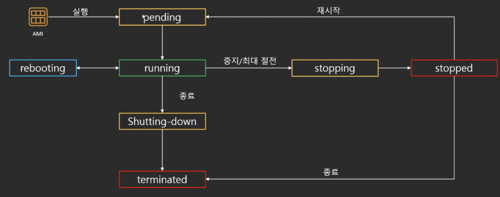
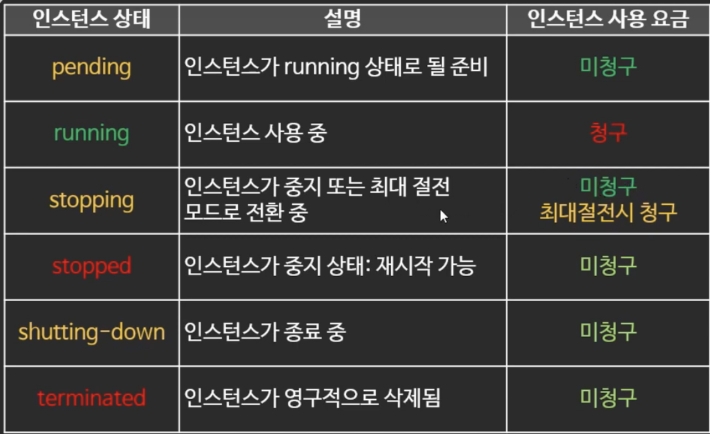
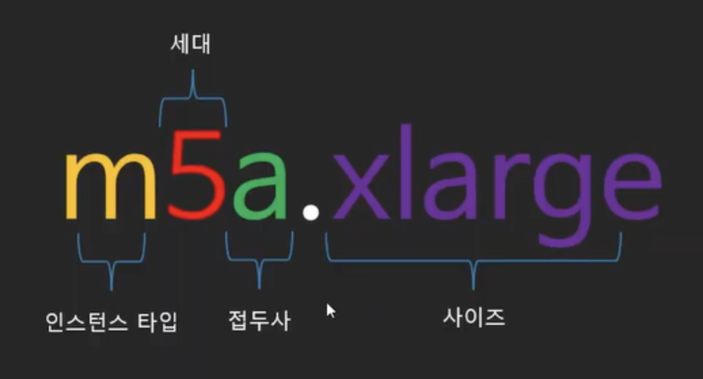

## 인스턴스란?
AWS 클라우드에서 사용하는 가상 컴퓨터
가상의 컴퓨터에의 CPU, 메모리, 그래픽카드 등 연산을 위한 하드웨어 부분을 담당.

## EC2 인스턴스 유형
-> 고사양 게임용, 서버용, 대량의 데이터 저장소, 영상용, 로봇 등 컴퓨터 하드웨어 구성에 따라 사용 목적을 정할 수 있는데 이게 **인스턴스 유형**

- 범용 : vCPU, 메모리, 네트워크, 저장 공간 등이 평균적인 사양으로 제공됨.
- 컴퓨팅 최적화 : 다른 인스턴스 패밀리에 비해 메모리 대비 vCPU 비율이 높음.
- 메모리 최적화 : 다른 인스턴스 패밀리에 비해 메모리 용량이 훨씬 큼.
- 스토리지 최적화 : 다른 인스턴스 패밀리보다 스토리지 용량이 훨씬 크거나 초고속 I/O가 제공됨.
- GPU 인스턴스 : 고성능의 NVDIA GPU가 장착되어 있음. CUDA, OpenCL 등을 실행할 때 사용됨.
- 마이크로 인스턴스 : 가격이 가장 싼 인스턴스. 낮은 vCPU 성능과 적은 메모리가 제공됨. 프리티어에서는 이 인스턴스 유형을 무료로 사용할 수 있음.

## 인스턴스 수명 주기 (Instance Life Cycle)

EC2의 수명 주기 = AMI로부터 실행이 되고 나서 종료될 때까지 EC2가 거치는 과정

**1) pending state**
제일 처음 AMI가 실행이 되었을 때의 준비 상태
EC2를 가동하기 위해서 가상머신, ENI, EBS 등이 준비되는 과정

**2) running state**
실제로 EC2를 사용할 수 있는 상태
running 상태에서 할 수 있는 것 3가지
- **중지**
	- 인스턴스를 잠깐 멈춰두는 것
	- 중지 중에는 인스턴스 요금 미청구
	- 단 EBS 요금, 다른 구성 요소(Elastic IP 등)은 청구
	- 중지 후 재시작할 때 퍼블릭 IP가 변경됨 (프라이빗 IP는 변경 X, 해결하려면 탄력적 IP 사용)
	- EBS를 사용하는 인스턴스만 중지 가능
- **재부팅**
    - 인스턴스를 다시 시작 하는 것
    - 중지하고 다시 시작과는 달리, 재부팅 시 퍼블릭IP 변동 X
- **최대 절전모드**
    - 메모리 내용을 보존해서 재 시작시 중단지점에서 시작할 수 있는 정지모드
    - 어떤 프로그램을 실행시켰을 때 데이터를 하드디스크에서만 가져오는 것이 아니라 메모리에 올려놓는 것
    - 컴퓨터/노트북의 최대 절전 모드와 같은 원리라고 보면 된다. 우리가 만일 프로그램을 이용하다 만일 프로그램이 켜 상태를 유지하면서 잠시 노트북을 꺼야한다면 최대 절전을 한다. 그리고 다시 노트북을 켰을때 아예 OS 재부팅되는게 아니라, 프로그램이 이어서 돌아가게 된다.

**3) shutting-down state**
**인스턴스 종료 중**
설정에 따라 EBS도 같이 종료 시킬 수도 있고 EBS는 남기고 인스턴스만 종료 할 수 있다.

**4) terminated state**
**완전히 종료, 인스턴스가 영구적으로 삭제된다**

인스턴스 미사용시 중지시켜두기만 해도 많은 비용을 절감 할수 있다.

## 인스턴스 타입 읽는법

- m은 인스턴스 타입(패밀리) (범용 애플리케이션 서버용)을 의미
- 5는 5세대를 의미
- a는 amd 기반의 CPU 프로세서를 사용한다는 의미
- xlarge는 큰 사이즈를 의미

