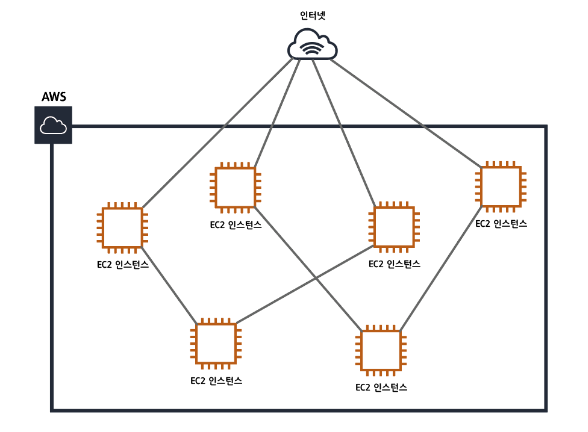
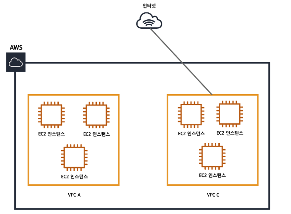
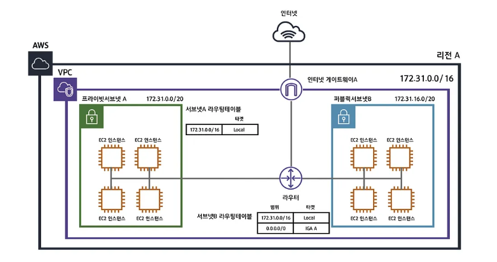

VPC : Virtual Private Cloud
-> 물리적으로 같은 클라우드 상에 있지만, 보안상의 목적 등을 위해 논리적으로 다른 클라우드인것처럼 동작하도록 만든 가상 클라우드 환경
- 사용자는 원하는대로 IP 주소 범위 선택, 서브넷 생성, 라우팅 테이블 및 네트워크 게이트웨이 구성 등 가상 네트워크 환경을 구성해 VPC를 생성할 수 있다.

-> VPC가 적용되지 않은 환경. 시스템이 복잡하고 인스턴스 하나만 추가해도 모든 인스턴스를 수정해야함

-> VPC가 적용된 환경. VPC별로 다른 네트워크 설정을 할 수 있음. 독립된 네트워크처럼 작동함

-> VPC가 Region에 상응하는 규모의 네트워크구나!
-> VPC는 각 Region에 하나씩 종속!! 다른 Region에 걸쳐서 확장 불가능!

## 서브넷
: 보안, 통신 성능 향상 등을 목적으로 VPC를 잘개 쪼갠 단위
더 많은 네트워크망을 만들기 위해서 필요함

### Public Subnet 
인터넷에 접근 가능한 Subnet (VPC 외부/내부와 통신)

## Private Subnet
인터넷에 접근 가능한 Subnet (VPC 내부에서만 통신)
서브넷의 라우팅 테이블에 인터넷 게이트웨이가 등록되어있지 않으므로 해당 서브넷에 위치한 리소소들은 외부와의 연결이 불가능함.

- VPC는 리전 하나에 종속, 각각의 VPC는 독립적
- VPC를 잘게 쪼갠 게 서브넷
- 서브넷 안에 RDS, EC2와 같은 리소스 위치

1. 네트워크 요청 발생
2. 데이터가 라우터로 향함
3. 정의된 라우팅 테이블을 보고 작동

**기타**
(인바운드 트래픽 : 외부에서 -> 인스턴스로 오는 트래픽)
(아웃바운드 트래픽 : 인스턴스에서 -> 외부로 가는 트래픽)

- 서브넷을 만들기 위해 네트워크를 분할하는 것을 **서브네팅** 이라고 함!!!

