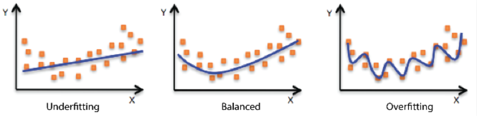

# Regularization
기계학습에서 overfitting을 방지하기 위해 사용되는 기법

데이터에 너무 과적합되어 모델이 피팅되었으니, 이를 좀 덜 적합하게,,, 새로운 데이터에도 일반적으로 들어맞는 모델을 만들어야 한다. 이 때 과적합이 아닌 일반성을 띄게 해주는 기법을 Regularization 이라고 한다....

보통 모델 학습에서 기대하는 모델은 가운데의 balanced 모델이다. 

오른쪽 그래프를 보면 모델이 구불구불하게 그려져있고, 과적합되어 있는 것을 확인할 수 있다. 그 이유는 모델의 차수가 크기 때문이다.

과적합을 피하기 위해서는 이 구불구불한 것을 조금 펴주면 된다. 그러려면 모델의 차수를 줄여주면 된다.

하지만 실제로는 모델의 차수를 직접 줄이는 방식에는 한계가 있다. 차수를 줄인다는 것은 곧 feature의 개수를 줄이는 것이고, 이는 데이터에 담긴 정보를 버리는 결과로 이어질 수 있기 때문이다.

따라서 feature를 그대로 유지하면서도 모델의 복잡도를 낮추는 방법이 필요하다.

이때 사용하는 방법이 바로 regularization이다. 

모델은 일반적으로 다음과 같은 형태를 가진다.  
$y = w_1x_1 + w_2x_2 + ... + w_nx_n + b$

여기서 각 w는 해당 feature가 결과에 얼마나 큰 영향을 미치는지를 나타낸다. 만약 특정 feature의 계수가 매우 크다면, 해당 feature가 모델을 크게 흔들게 되고 과적합되는 원인이 된다.

따라서 regularization에서는 이러한 가중치 w의 크기를 제한하여 모델이 지나치게 복잡해지는 것을 방지한다. 차수를 직접 줄이는 대신 각 항의 영향력을 줄여 모델을 더 단순하게 만드는 것이다. 

이를 위해 기존의 cost function에 가중치 크기에 대한 패널티 항을 추가한다.

### L1 Regularization (Lasso)
$J = \frac{1}{n}\Sigma(\hat{y}_i - y_i)^2 + \alpha\Sigma|w_j| $

가중치의 절대값 합을 패널티로 사용하는 방식이다. L1의 특징은 일부 가중치를 정확히 0으로 만들어버린다는 점이다. 즉 중요하지 않은 feature의 영향을 완전히 제거하는 효과가 있어, 자동으로 feature selection이 이루어진다. 

### L2 Regularization (Ridge)
$J =\frac{1}{n}\Sigma(\hat{y}_i - y_i)^2 + \alpha\Sigma w_j^2 $

가중치의 제곱합을 패널티로 사용하는 방식이다. 가중치가 클수록 제곱값이 크게 증가하므로, 전체적으로 모든 가중치를 작게 만드는 방향으로 학습이 이루어진다. 그 결과 모델은 부드러운 곡선을 가지게 되며, 과도하게 구불구불한 형태를 완화할 수 있다.

