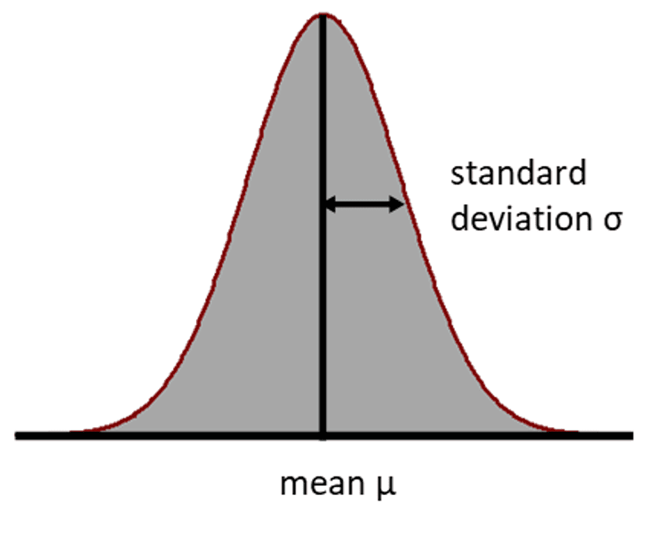

# Gaussian Distribution

## Unvariate Gaussian Distribution
- 실수 전체의 집합 R에서 정의된 연속확률변수 X의 확률밀도함수 f(x)가 아래 형태를 띌 때의 확률분포

$f\left(x\right)=\frac{1}{\sqrt{2\pi }\sigma }\exp \left(-\frac{\left(x-\mu \right)^2}{2\sigma ^2}\right)\ \ \left(x\in R\right)$

- $\mu$은 연속확률변수 X의 평균
- $\sigma$는 연속확률변수 X의 표준편차

이러한 정규분포의 확률밀도함수 f(x)에 대한 그래프를 정규분포곡선이라고 한다.

아래와 같이 간단하게 표기할 수도 있다.  

$N(\mu, \sigma^2)$

주의해야할 점은 위 정규분포곡선 그림은 확률이 아니라 확률밀도함수(pdf)라는 점이다.

확률은 확률밀도함수 자체가 아니라 면적을 구해서 따진다. 정규분포자체는 연속확률이며, 특정 값에서의 확률은 0이기 때문이다.

그렇기 때문에 특정 값에서의 확률을 구할수가 없는데, y값이 높을수록 일어날 가능성이 높은 사건이라고 볼 수 있다.   
$\mu$ 와 $\sigma$에 따라 확률에 해당하는 면적이 달라지는데,  
$\sigma$가 커질수록 더 넓어지고, $\sigma$가 작을수록  좁아진다.  
$\mu$값에 따라 좌우로 움직일 수 있다.

## Multivariate Gaussian Distribution
$N(y|\mu, \Sigma) = \frac{1}{(2\pi)^{D/2}|\Sigma|^{1/2}} exp[-\frac{1}{2}(y-\mu)^\top\Sigma^{-1}(y-\mu)]$

$D$ : 데이터의 차원  
$y$ : random vector  
$\mu$ : mean vector  
$\Sigma$ : covariance matrix

$Cov[y] = \mathbb{E}\left [(y - \mathbb{E}[y])(y - \mathbb{E}[y]^\top) \right]$

$\mathbb{E}[yy^\top] = \Sigma + \mu\mu^\top$

$\mathbb{E}[yy^\top]$ : 평균이 포함된 전체 구조  
$Cov[y]$ : 평균이 제거된 순수 퍼짐만 남은 구조

pdf by MVN is represent by

$y \sim N(\mu, \Sigma), \text{where } y \in \mathbb{R}^2, \mu \in \mathbb{R}^2$

$\Sigma = \begin{pmatrix} \sigma_{1}^{2}& \sigma_{12}^{2} \\ \sigma_{21}^{2}& \sigma_{2}^{2}\end{pmatrix} = \begin{pmatrix} \sigma_{1}^{2} & p\sigma_1\sigma_2\\ p\sigma_1\sigma_2& \sigma_2^2 \end{pmatrix}$

$p$ = Correlation coefficient (상관계수)
$corr[Y_1, Y_2] = p = \frac{Cov[Y_1, Y_2]}{\sqrt{\mathbb{V}[Y_1]\mathbb{V}[Y_2]}} = \frac {\sigma_{12}^2} {\sigma_1\sigma_2}$

