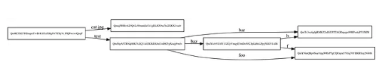

## HTTP -> IPFS
1) 도메인 이름 주소 지정이 아닌 콘텐츠 주소 지정을 한다. 도메인 이름 대신 콘텐츠 해시를 사용하게 된다.
2) 분산 웹을 통해 강화 및 네트워크 액세스, 효율성, 보안, 404, 오프라인 사용 등의 문제를 해결할 수 있다.

## IPFS의 특징
- 중앙화된 서버 없이 노드들의 P2P 통신으로 실현한 더 빠르고 안전한 열린 네트워크. 대형 서버의 연결이 차단되면 치명적인 결과를 낳는 HTTP Web과는 달리, IPFS에서는 몇몇 노드들의 연결이 끊어지더라도 생태계가 안정적으로 유지된다.
- 고용량의 파일을 빠르고 효율적이게 전달할 수 있으며(BitSwap), 파일들의 중복을 알 수 있기 때문에 저장소도 효율적으로 사용할 수 있다(Merkle DAG, contents-addressed).
- IPFS 상에 업로드된 파일의 이름은 영원히 기록되며, 만약 IPFS 상에서 지키고 싶은 파일은 원하는 만큼 지켜낼 수 있다(pinning). 또한 파일의 버전 관리(Git)가 가능하다.
- 주류 인터넷에 원활하게 접속할 수 없는 상황이더라도 IPFS의 생태계는 유지된다.

## IPFS의 작동 방식
- 각각의 파일은 여러 개의 블록으로 이루어져 있으며, 각각의 블록은 해시로 표현된 고유의 이름이 있다.
- IPFS는 모든 파일의 이름을 데이터베이스 속에 저장하며, 동일 파일의 중복을 배제하며, 각 파일의 버전 정보를 트래킹한다.
- 각 노드는 본인이 관심있는 파일만 저장소에 보관하며, 인덱싱 정보를 통해 누가 어떤 파일을 저장하고 있는지 알 수 있다.
- 네트워크에서 파일을 찾기 위해서는, 파일명을 조회하고 해당 파일을 갖고 있는 노드를 물어보면 된다.
- IPNS를 통해 모든 파일명은 인간이 읽기 쉬운 형태(DNS와 유사한 개념)로 변환할 수 있다.

## IPFS 기반 기술
IPFS Web은 다양한 기술들의 조합이다.

### (1) Distributed Hash Tables(DHT) -Routing
**DHT란 무엇인가?** \
: 네트워크에 참여한 노드들이 해시 테이블을 각자 관리함으로써 중앙화된 서버 없이 고도의 P2P 네트워크를 실현할 수 있으며, 이를 분산 해시 테이블(DHT) 기술이라고 한다. \
어떤 파일을 찾아갈 때 해시 테이블을 이용하는데, 중앙 시스템이 아닌 각 노드들이 이름을 값으로 맵핑하는 기능을 하는 방식이다. 파이썬으로 치면 dictionary에 해당한다. \
DHT의 운영방식에 따라 얼마나 빠르고 효율적으로 네트워크 요청을 소화해낼 수 있는지가 결정되며 노드의 네트워크 진입/이탈, 신규 컨텐츠 등록 등이 어떻게 관리되는지가 달라진다.

DHT는 순수 P2P라도 네트워크의 부하를 억제할 수 있으며 네트워크 상의 콘텐츠를 빠르고 정확히 검색할 수 있는 것이 가능하다. 종래의 순수 P2P에서 채용되었던 방식에서는 수십만 노드 정도가 한계였으나, DHT의 사용으로 수십억개의 노드를 검색범위로 할 수 있게 되었다.

> HTTP: 컨텐츠의 위치(IP) 주소를 알고 찾아갔으나, 그 위치에 컨텐츠가 더 이상 존재하지 않으면 영영 잃게 되는 문제가 발생한다.
> IPFS: 컨텐츠 자체를 찾는다. 컨텐츠 자체가 주소 역할을 하는 것이며, 이를 'content-addressed'라고 한다.

: 따라서 해시테이블 상에서 컨텐츠 이름을 찾으면, 해당 컨텐츠를 보유하고 있는 노드를 알 수 있다.
### (2) Bittorrent - File exchange
: P2P 파일 교환 프로토콜
- HTTP : 서버가 파일을 가지고 있고 클라이언트가 서버로부터 파일을 받아간다.
- IPFS : BitTorrent에서 하나의 파일을 여러 조각으로 나누어, 각 노드끼리 자신이 갖고 있는 조각의 정보를 알려주고 다른 노드들에게 자신이 필요한 조각을 요청한다.
- 노드들끼리 무수히 많은 세션을 생성한다.
- 세션이 늘어남에 따라 사용자의 다운로드 속도가 증가하고, 노드가 사용하는 인터넷 환경의 최대 대역폭까지 다운로드 속도가 증가한다.

**Bit Swap이란?**
BitTorrent에서 영감을 얻은 프로토콜이다. \
BitTorrent에서처럼, Peer들은 본인이 얻고 싶은 파일블록(want_list)와 본인이 갖고 있는 파일블록(have_list)가 있다. 그러나, BitTorrent는 하나의 파일을 받고자할 때 그 파일의 블록들만 한정적으로 받아올 수 있는 반면, BitSwap에서는 일치하는 파일 블록이라면 어떤 파일에 속해 있든지 받아올 수 있다는 장점이 있다.

만약 노드들이 받기만 하려고 하고 줄 생각이 없다면 문제가 된다. 이를 해결하기 위해 BitSwap은 기본적으로 물물교환 시스템을 표방한다. 무언가 받기 위해서는 무언가를 주어야 한다. 상대방에게 내가 원하는게 있지만, 내가 대가로 줄게 없다면 어떻게 되는가? 그 노드는 열심히 일해서 굉장히 희귀한 파일블록이라도 얻어서 보유해놓아야 한다. 이는 희귀한 파일블록들이 더욱 배포, 확산되는 효과를 낳는다.

BitSwap Credit : 노드들이 peer에게 파일블록을 보내주면, 보낸 노드는 자산이 증가하며 받은 노드는 부채가 증가한다.
평판이 쌓이는 구조이므로 받기만 하는 어뷰징을 막을 수 있고, 파일블록을 보유하고 보내주는 것에 인센티브가 생기게 된다.

### (3) Git(merkle DAG) - version control systems
: IPFS는 네트워크 상에 존재하는 모든 파일을 Merkle DAG 형식으로 정리(organize)한다.

**Merkle Tree란?**

- Binary Tree. 
- 연쇄적으로 해시 함수가 사용되기 때문에(아버지 해시 = hash(아들1 해시 + 아들2 해시)) 데이터가 조금이라도 위변조 될 경우, root hash가 달라지기 때문에, 간단하게 데이터 무결성을 확인할 수 있다.
- leaf node에서만 데이터 보유 가능.

**Merkle DAG란?**

- Graph. 아무 노드나 데이터를 보유할 수 있다.

**Merkle DAG 구조를 통해, IPFS는 세가지 중요한 특성을 갖는다.**
- Content Addressing : 모든 컨텐츠는 그 자체가 링크이며, multihash checksum으로 그 무결성을 확인할 수 있다.
- Tamper resistance : 모든 컨텐츠는 자체적으로 checksum으로 무결성을 확인할 수 있고, 위변조시 merkle root의 hash 값이 변경되기 때문에 IPFS 자체적으로 감지할 수 있다.
- Deduplication : 같은 컨텐츠는 같은 해시 값을 갖기 때문에, Merkle DAG 상에서 컨텐츠가 중복되지 않는다.

### (4)SFS(Self-certified FileSystems)
**SFS란?**
- IPFS의 name system인 IPNS를 시행하기 위한 기반 기술이다.
- 주소는 /sfs/(Location):(HostID)의 형식으로 표현되며, 여기서 Location은 서버의 주소이다.
- HostID는 hash(서버가 제공한 공개키 + Location)이다.
- 따라서 이용자는 서버가 제공한 공개키를 통해, 그 서버가 '주소와 일치하는 서버'임을 확인할 수 있다.

**IPNS란?**
- 파일 이름을 기준으로 Merkle DAG을 형성하는데, 모든 파일은 각각 영구적인, 변경할 수 없는 이름이 생기는 것이다.
- 때로 변경 가능한 이름이 필요하기도 한데, 이를 위해 DNS 처럼 IPNS를 통해 변경 가능한 이름을 만들 수 있다.
- IPNS 주소 또한 self-certification이 가능하도록 설계되었다.

- HTTP :  위치기반 주소지정 방식 -> 어디서 찾을 것인가?
- IPFS : 컨텐츠기반 주소지정 방식 -> 무엇을 찾을 것인가?

### IPFS의 저장 방식
파일들은 IPFS 개체에 저장된다. -> 한 개체당 256kb까지 저장 가능
사진이나 영상 같은 큰 파일은 여러 개의 IPFS 개체에 나눠져서 저장된다.

IPFS는 컨텐츠 기반 주소지정을 사용하므로 한번 네트워크에 추가되면 변경 불가능하다.
(블럭체인과 같은 불변성)

변경을 하고 싶다면? Versioning을 지원한다.
'커밋 개체' 를 생성하면, 어떤 커밋이 이루어졌는지와 해당 파일이 담긴 IPFS 개체로의 링크를 담는다. 업데이트 하고 싶다면 그냥 업데이트 된 파일을 IPFS 네트워크에 추가시키기만 하면 된다. 그러면 소프트웨어는 새로운 커밋 개체를 생성하고, 이 새로운 커밋 개체는 이전에 제출된 커밋 개체와 링크를 형성한다.

### IPFS의 한계점
IPFS 네트워크상에서 어떻게 해당 파일을 계속 유지해줄 것인가?
캐시를 유지해줘야하는데 그걸 호스트하는 노드들이 오프라인이 된다면 파일 다운로드가 불가능해진다.

### 해결방안
- Incentivize nodes: 유저들이 파일 저장 및 유지에 대한 인센티브를 지불
- Proactively distribute files: 적극적으로 파일들을 배포함으로써 네트워크 상에 특정 수 이상의 사본들이 존재하도록 하기

## File Coin
저장공간의 분산화 시장을 만드는 것을 목적으로 만들어진 IPFS 기반 블럭체인.
하드 드라이브에 여분의 저장공간이 있다면 그 공간을 다른 이들에게 임대함으로써 수익을 올리는 절차를 채택한다.
노드들에게 인센티브로 지불하기 위해 만들어진 코인.
노드들은 가능한한 파일들을 온라인 상태로 유지하여야 보상을 받을 수 있다.

-> 파일코인 시스템은 파일들을 다수의 노드들에 복제시켜서 다운로드 불가 상태가 되지 않도록 만든다.

### IPFS는 어떻게 활용 가능한가?
ex1) 2017년 터키정부가 위키피디아 접속을 차단한 적이 있었다. \
이때 IPFS 측 사람들이 이에 대응하여 위키피디아 터키 버전의 사본을 IPFS에 넣었다. \
IPFS는 분산배포되어 있으므로 정부가 block할 수 있는 중앙 서버가 존재하지 않았기 때문이다.
ex2) Dtube -> Youtube와 같은 느낌인데 IPFS를 이용해 완전하게 분산화 되어있음

