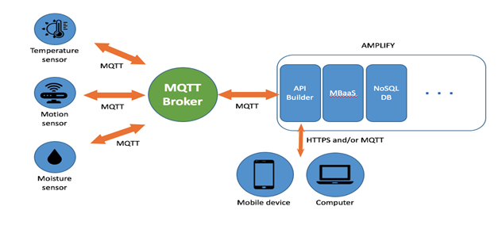
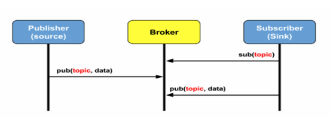
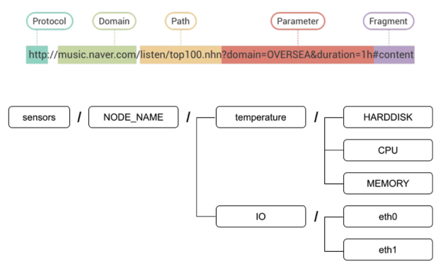
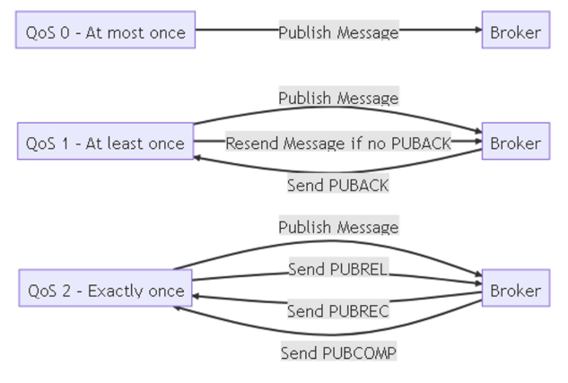

## Message Queuing Telemetry Transport
## MQTT란?
- M2M(Machine-to-Machine)을 기반으로 하는 IoT 개방형 프로토콜이다.
- 경량의 메시징 프로토콜 또는 규칙 세트이다.
	- 최소한의 전력과 리소스로 마이크로컨트롤러와 같은 IoT와 모바일 어플리케이션 등 통신에 적합하다.
- 애플리케이션 Layer 프로토콜이다.
	- 일반적인 http와 같은 프로토콜과 달리 클라리언트/서버 방식 대신, 메시지 매개자(broker)를 통해 송신자가 특정 메시지를 발행(publish)하고 수신자가 메시지를 구독(subscribe)하는 방식을 사용한다.

## Broker / Publisher / Subscriber

- Publisher는 특정 Topic을 통해 Broker에게 메시지를 전송.
- Broker는 Publisher가 발행한 Topic을 가지고 있고 Subscriber는 Topic을 기준으로 Broker에 구독을 요청.
- Subscriber는 polling(주기적인 체크) 방식을 이용하여 Broker에 있는 Topic을 조회해 감.

## Topic
Topic은 게시한 메시지의 라벨과 같은 제목(UTF-9 문자열)으로 해당 토픽을 구독한 클라이언트 모두에게 해당 토픽 메시지를 브로커가 배포한다. \
Publisher와 Subscriber는 Topic을 기준으로 메시지를 발행하거나 구독한다. Topic은 문자열로 구성되어 있기 때문에 / 를 이용하여 계층적으로 구성할 수 있어서 대량의 센서 기기들을 효율적으로 관리할 수 있다.

- 계층 구조: 계층 구조의 수준은 슬래시(/)를 사용하며 파일 시스템과 유사하게 유사한 토픽들을 계층화 가능
- 와일드카드 구독: "+", "#" 두 가지의 와일드카드로 topic에 특별한 기능을 추가 가능
- 대소문자 구분: home/temperature와 home/Temperature는 서로 다른 주제
- 빈 레벨 없음: /home//temperature와 같이 빈 레벨이 있는 topic은 유효하지 않음

## QoS
: Quality of Service의 약자로 mqtt 프로토콜만 아니라 다양한 네트워크 및 통신의 영역에서 사용되는 말 그대로 메시지의 quality를 보장하는 서비스이다. \
무선 네트워크 통신 망은 아무래도 유선 네트워크 망과 비교해 방해 요소도 다양하고 불안정할 수 밖에 없다. 하지만 메시지의 타입과 구현하는 시스템의 성격에 따라 무선 네트워크 망에서 항상 완벽한 수준으로 데이터를 전송할 필요가 없는 케이스도 존재한다.

### QoS-0 (At most Once)
메시지는 딱 한번 전송되며 클라이언트에게 전달 여부를 확인하지 않고 바로 잊어버린다. 

### QoS-1 (At least Once)
메시지는 최소 한 번 이상 전달되며 Publisher에게 PUBACK을 전달하여 성공 여부를 전달한다. Publisher가 PUBACK을 성공적으로 전달받지 못하면 Subscriber에게 중복 메시지를 보내는 경우가 생긴다.

### QoS-2 (Exactly Once)
메시지는 반드시 한번만 전달된다. 메세지의 핸드셰이킹 과정을 추적하며 가장 안전하고 퀄리티를 보장하지만 반대로 가장 느린 전송 레벨이다.