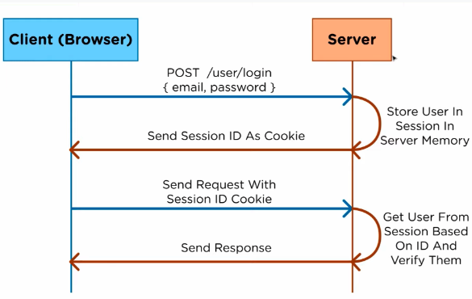
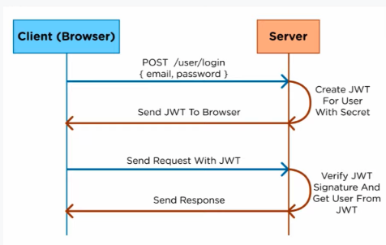

- Authentication(인증) : 로그인과 같이 사용자 혹은 프로세스의 신원을 확인
- Authorization(인가) : 사용자 또는 디바이스 등이 어떤 리소스에 접근할 수 있는지, 어떤 동작을 수행할 수 있는지 등을 검증

---

## Session 방식

1. 클라이언트가 로그인을 위해 인증 정보를 서버에 전송
2. 서버는 메모리에 사용자를 저장하고, 세션 아이디를 쿠키로 전달
3. 클라이언트는 쿠키에 저장된 세션 아이디를 이용하여 요청
4. 서버는 일치하는 세션 아이디를 메모리에서 검색한 후 응답

## JWT

1. 클라이언트가 로그인을 위해 인증 정보를 서버에 전송
2. 서버는 secret 정보를 이용하여 JWT를 생성하고, 클라이언트에게 전달
3. 클라이언트는 로컬 혹은 브라우저에 저장해두었던 JWT를 이용하여 요청
4. 서버는 JWT가 일치하는지 확인한 후, 응답