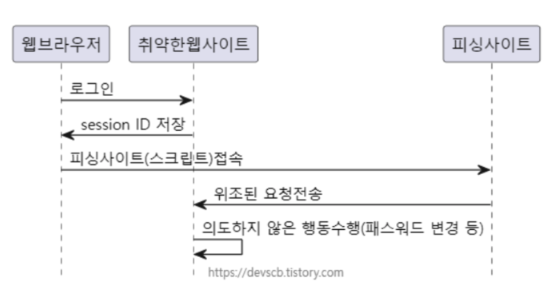

### CSRF란?
Cross-Site Request Forgery의 약자로, 사이트 간 요청 위조를 의미한다. 
사용자가 자신의 의지와는 무관하게 공격자가 의도한 행위를 특정 웹 사이트에 요청하게 하는 공격을 말한다. 

### CSRF가 가능한 이유?
CSRF 공격이 가능한 이유는 웹 브라우저가 사용자가 인증한 상태를 유지하기 때문!
공격자는 사용자가 인증되어 있는 상태를 악용하여 공격자가 의도한 행위를 하도록 유도한다

#### CSRF가 성공하기 위한 조건 세 가지
1. 사용자는 보안이 취약한 서버로부터 이미 로그인이 되어있는 상태
2. 쿠키 기반의 서버 세션 정보를 획득할 수 있어야 함
3. 공격자는 서버를 공격하기 위한 요청방법에 대해 미리 파악해야 함.

#### CSRF 공격이 이루어지는 과정

1. 사용자가 서버에 로그인
2. 서버에 저장된 세션 정보를 사용할 수 있는 session ID가 사용자의 브라우저 쿠키에 저장된다.
3. 공격자는 사용자가 악성 스크립트 페이지를 누르도록 유도한다
	1. 게시판에 악성 URL 기재
	2. 메일 등으로 악성 스크립트를 전달
	3. 악성 스크립트가 적힌 페이지 링크를 전달 등등
4. 사용자가 악성 스크립트가 작성된 페이지 접근 시, 웹 브라우저에 의해 쿠키가 저장된 session ID와 함께 서버로 요청됨.
5. 서버는 쿠키에 담긴 session ID를 보고 해당 요청이 인증된 사용자로부터 온 것으로 판단하고 처리

### CSRF 공격 방지
- CSRF 공격 방지의 핵심
	- 공격자 요청과 서비스 웹사이트 상의 실제 요청을 구분하는 것이다. 이 두 요청을 구분할 수 없다면 CSRF 공격에 취약해질 수 있다.
- CSRF 보호를 비활성화 (disable) 해도 되는 경우?
	- 클라이언트 기반 인증 방식 (토큰 등)을 사용하는 경우는 각 요청마다 인증하게되므로
	- 브라우저가 아닌 애플리케이션의 클라이언트가 이용하는 경우에는 CSRF를 비활성화 할 수 있다.
	- 주류 의견: RestAPI는 JWT 등 토큰 기반 인증을 사용하는 경우가 많기 때문에 (stateless하게 개발) disable해도 무방하다

### Spring JWT 코드에서 CSRF를 disable한 이유
spring security documentation -> non-browser clients 만을 위한 서비스라면 csrf를 disable해도 좋다고 나와 있음
: 이 이유는 rest api를 이용한 서버라면 session 기반 인증과는 다르게 stateless하기 때문에 서버에 인증정보를 보관하지 않음. rest api에서 client는 권한이 필요한 요청을 하기 위해서는 요청에 필요한 인증 정보를 포함시켜야 함. 따라서 서버에 인증정보를 저장하지 않기 때문에 굳이 불필요한 csrf 코드들을 작성할 필요가 없다.