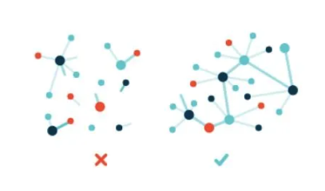

## HTTP란?
- 인터넷 상에서 데이터를 송수신하는 핵심 규약이다.
- 방식: 각 클라이언트가 중앙 서버에 자료를 요청하면, 중앙 서버에서 해당 자료를 제공하여 열람하는 방식
- 브라우저를 통해 누구나 쉽게 하이퍼링크로 연결된 웹 페이지들에 접근할 수 있게 되었고, HTTP 요청으로 얻은 결과를 그래픽, 사운드, 문자, 비디오 등의 형태로 볼 수 있다.

## HTTP 방식의 문제점
### (1) HTTP Web은 불안정(brittle, low resiliency)하다.

HTTP 프로토콜은 Client가 Server에 request를 보내면 Server에서 response를 하며 데이터를 보내주는 구조로 되어있다. \
따라서 만약 서버의 전원이 차단되면 링크가 끊겨버리고, 해당 컨텐츠에 대한 접근할 수 있는 방법이 없다.
만약 웹 페이지의 서버가 해킹되어 모든 데이터가 삭제된다면, 분서가 일어나는 것과 다름 없다. 

404 에러가 뜨면 요청한 페이지를 찾을 수 없다는 의미로, 컨텐츠가 삭제되거나 알 수 없는 곳으로 옮겨졌다는 것이다. \
보통 서버가 백업 없이 고장나거나 닫히는 경우, 도메인 주인이 바뀐 경우, 기업이 해산한 경우 등 많은 원인이 있다.

### (2) HTTP Web의 고도 중앙화(Hyper Centralization)되었다.

웹의 태생적 목표는 탈중앙화였다. 그러나 오늘날의 웹은 수억명의 사람들이 소수 서비스에 의존하면서 굉장히 빨리 중앙화되었다. \
이는 HTTP가 의도하던 방향이 아니다. 미국의 NSA 혹은 국정원이 몇 개의 서버만으로 우리를 철저히 감시할 수 있고, 마음대로 특정 컨텐츠를 차단해버릴 수 있기 때문이다. \
중앙화된 서버는 또한 DDoS 공격이 성공할 경우 더욱 큰 피해를 야기할 수 있다.

Web 분산화를 통해 소수의 강력한 기관들––이 Web을 제멋대로 주무를 수 없게 할 수 있다. \
Web이 분산화된다면, 큰 기관 하나가 무너지더라도 수많은 데이터가 유실되는 경우를 방지할 수 있을 것이다.

### (3) HTTP Web은 비효율적(inefficient)이다.

강남스타일의 뮤직비디오 용량은 117MB이고, 누적 31억뷰이다. 이것은 31억 번의 request를 받고 117MBx31억 을 유저들에게 전송했다는 것이다. 이는 360.7PB의 데이터가 전송되었다는 것이며, 1GB 전송에 100원이 소요되었다고 계산해도 36억 2700만원이 파일 분배에 소모되었음을 의미한다. \
시간이 지날수록 점점 영상의 질이 증가하면서 그 용량 또한 폭증하여 대용량의 파일들을 다루고 있다. (ex. 고화질 스트리밍 서비스) \
Bandwidth 발전 속도가 다른 Storage 발전 속도를 따라가지 못하고, 이는 통신 속도가 느려진다는 것을 시사한다.

### (4) HTTP Web은 느리다(Latency Problems).

지리적으로 가까운 곳에 서버가 존재하면 아무런 문제가 되지 않지만, 서버가 굉장히 먼 지역에 위치하면 파일 전송이 그만큼 느려진다. \
서비스 업체들은 세계 곳곳에 데이터 센터를 설립하는 방법으로 대응해왔지만, 이 해결법에는 한계가 존재한다.

### (5) Overdependence on the Internet Backbone

특정 서버의 데이터를 얻기 위해서는 반드시 그 서버와 연결되어 있어야 한다. \
인터넷 연결이 끊어지는 상황이 발생하면(ex. 개발도상국의 통신선 미비, 자연재해로 인한 유실 등) 해당 서버에 접근할 수 없기 때문에 원하는 데이터를 얻을 수 없다. \
이렇게 인터넷 연결에 과도하게 영향을 받는다는 문제가 있다.

이러한 이유들로 IPFS를 사용한다.