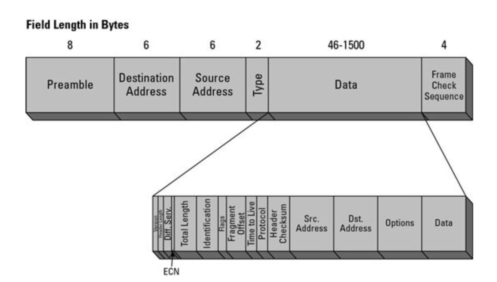
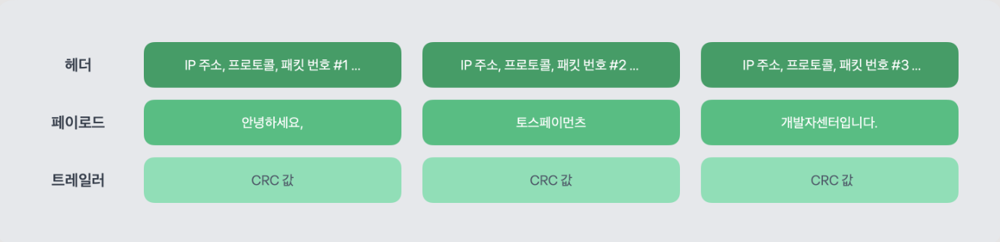

# 패킷
네트워크에서 데이터를 주고받을 때 사용되는 데이터 조각 \ 
인터넷을 통해 주고 받는 데이터는 모두 패킷으로 전달, 수신 된다.

## 패킷의 구성
- 헤더(Header)에는 패킷에 대한 메타정보가 있다. 패킷의 길이, 번호, 네트워크 프로토콜, 수신자 및 발신자의 IP 주소 등 데이터가 잘 전달되기 위해 필요한 정보가 있다.
- 페이로드(Payload)는 수신자가 요청한 데이터이다. 이메일을 받는 수신자라면 이메일 본문 내용이고, 이미지를 클릭한 사용자라면 이미지 데이터이다.
- 트레일러(Trailer)는 패킷의 끝을 나타내기 때문에 여러 패킷의 경계를 뚜렷하게 알리는 역할을 한다. 트레일러는 오류 검출의 역할을 수행하기도 하는데, 체크섬(Checksum) 또는 CRC(Cyclic Redundancy Check)와 같은 오류 검출 코드가 트레일러에 포함되어 있으면 전송 중에 데이터 손실과 같은 오류가 발생했는지 판단할 수 있다.

ex.) "안녕하세요, 토스페이먼츠 개발자센터입니다." 라는 본문 데이터가 있을때, 3개의 패킷으로 나눈다고 생각해보면 \
각 패킷의 헤더에는 발송자의 IP 주소, 수신자의 IP 주소, TCP와 같은 프로토콜 정보, 패킷 번호 등의 메타데이터가 존재한다. \
페이로드에는 이메일 내용이 나뉘어 포함된다. \
트레일러에는 CRC 값과 같은 오류 검출 코드가 있다. 수신자가 패킷을 받은 다음 CRC 값을 계산하고 트레일러에 있는 값과 같은지 확인한다.
만약 일치하지 않는다면 수신자는 발송자에게 다시 패킷 전송을 요청한다.

## 패킷이 왜 필요한가?
데이터를 하나로 보내면 여러 문제가 일어날 수 있다. 전송 과정에서 오류가 일어나면 전체 데이터가 손실될 위험이 있고, 손실의 경우 전체 데이터를 다시 전송해야 되기 때문에 시간이 오래 소요되고 네트워크 자원이 낭비된다. 또 대용량 데이터를 전송하려면 네트워크가 혼잡해지고 네트워크를 사용하는 모든 사용자의 속도가 저하될 수 있다. \
반면 데이터를 작은 용량의 패킷으로 나누어 발송하면 패킷을 여러 서버로 분산시킬 수 있다. 특정 네트워크에 부담이 되지 않고 트래픽을 균일하게 분배할 수 있다. 여러 서버를 사용하므로 데이터 전송을 병렬로 처리하기도 용이하다. 데이터 전송 시간을 줄이고 사용자에게 좋은 경험을 제공할 수 있다. 만약 발송 중에 특정 패킷의 데이터가 손실되어도 해당 패킷의 데이터만 재전송하면 되기 때문에 효율적이다.

다만 패킷에 고유 번호를 매겨야하고, 이 순서를 양측이 동일하게 사용해야 한다는 단점이 있다. \
이 때문에 이런 것들을 포함한 통신 규칙인 프로토콜이 등장!!